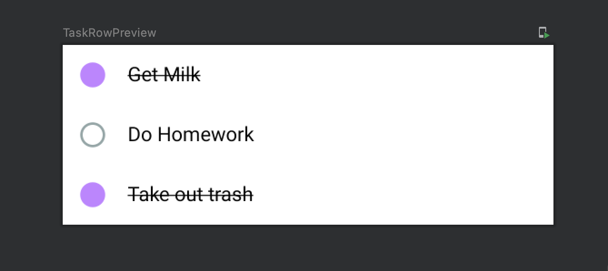
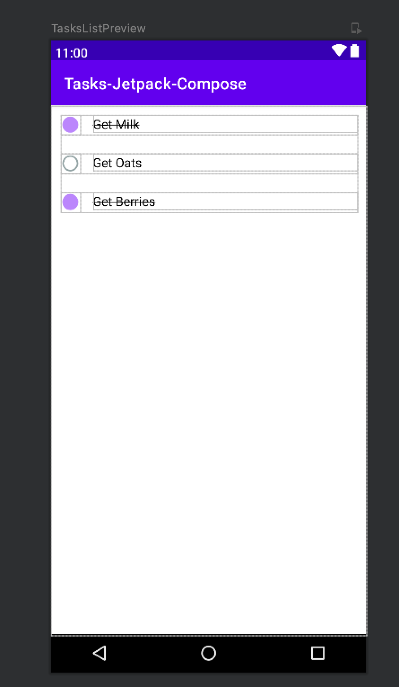

In the last part of the tutorial we referenced a class called `TasksListScreen`. This screen will show a `List<Task>` using a JetPack Compose Column.

## 4-1 Create a `TaskRow` views

Each row of the tasks will be represented by a `@Composable` `TaskRow` which takes in a `Task` and two callbacks which we will use later.

1. If the `task.isCompleted` is `true`, we will show a filled circle icon and a
strike through style for the `body`.
2. If the `task.isCompleted` is `false`, we will show a filled circle icon and a strike through style for the `body`.
3. If the user taps the `Icon`, we will call a `onToggle: ((task: Task) -> Unit)?`, we will reverse the `isCompleted` from `true` to `false` or `false` to `true`
4. If the user taps the `Text`, we will call a `onClickBody: ((task: Task) -> Unit)?`. We will use this to navigate to the `EditScreen`

For brevity, we will skip discussions on styling as it's best to see the code snippet below:

We've also included included a `@Preview` `TaskRowPreview` which allows you to quickly see the end result with some test data.



```kotlin title="TaskRow.kt"
@Composable
fun TaskRow(
    task: Task,
    onToggle: ((task: Task) -> Unit)? = null,
    onClickBody: ((task: Task) -> Unit)? = null) {

    val iconId =
        if (task.isCompleted) R.drawable.ic_baseline_brightness_1_24 else R.drawable.ic_baseline_panorama_fish_eye_24
    val color = if (task.isCompleted) R.color.purple_200 else android.R.color.darker_gray
    var textDecoration = if (task.isCompleted) TextDecoration.LineThrough else
        TextDecoration.None
    Row(
        Modifier
            .fillMaxWidth()
            .padding(12.dp)

    ) {
        Image(
            ImageVector.vectorResource(
                id = iconId
            ),
            "Localized description",
            colorFilter = tint(colorResource(id = color)),
            modifier = Modifier
                .padding(end = 16.dp)
                .size(24.dp, 24.dp)
                .clickable { onToggle?.invoke(task) },
            alignment = CenterEnd
        )
        Text(
            text = task.body,
            textDecoration = textDecoration,
            fontSize = 16.sp,
            modifier = Modifier
                .alignByBaseline()
                .fillMaxWidth()
                .clickable { onClickBody?.invoke(task) })
    }
}

/**
 * Used to preview the code:
 */
@Preview(showBackground = true)
@Composable
fun TaskRowPreview() {
    Column() {
        TaskRow(task = Task(UUID.randomUUID().toString(), "Get Milk", true))
        TaskRow(task = Task(UUID.randomUUID().toString(), "Do Homework", false))
        TaskRow(task = Task(UUID.randomUUID().toString(), "Take out trash", true))
    }
}
```

## 4-2 Create a `@Composable` `TaskList`

Next we will need to show a `List<Task>` by looping over it and creating a `TaskRow` for each element. This gives us a scrollable list behavior.

1. The `TaskList` takes in a `List<Task>` and loops over it in a `Column` with a `.forEach` loop.
2. Each iteration of the loop will render a `Task(task)`
3. We've also added `onClickBody` and `onToggle` callback that matches the `Task.onClickBody` and `Task.onToggle` functions.

We've also included a `TaskListPreview` so that you can add some test data.



```kotlin title="TaskList.kt"
@Composable
fun TasksList(
    tasks: List<Task>,
    onToggle: ((taskId: String) -> Unit)? = null,
    onSelectedTask: ((taskId: String) -> Unit)? = null
) {
    Column() {
        tasks.forEach { task ->
            TaskRow(
                task = task,
                onClickBody = { onSelectedTask?.invoke(it._id) },
                onToggle = { onToggle?.invoke(it._id) }
            )
        }
    }
}

@Preview(
    showBackground = true,
    showSystemUi = true,
    device = Devices.PIXEL_3
)
@Composable
fun TaskListPreview() {
    TasksList(
        tasks = listOf(
            Task(UUID.randomUUID().toString(), "Get Milk", true),
            Task(UUID.randomUUID().toString(), "Get Oats", false),
            Task(UUID.randomUUID().toString(), "Get Berries", true),
        )
    )
}
```

## 4-3 Create a `@Composable` `TasksListScreenViewModel`

The entire screen's data will be completely controlled by a Jetpack Compose `ViewModel`. The use of `ViewModel` is a design pattern called [MVVM or Model View ViewModel](https://proandroiddev.com/architecture-in-jetpack-compose-mvp-mvvm-mvi-17d8170a13fd) which strives to separate all data manipulation (Model and ViewModel) and data presentation (UI or View) into distinct areas of concern. When it comes to Ditto, we recommend that you never include references to `ditto` in `@Composable` types. All interactions with `ditto` for `insert`, `update`, `find`, `remove` and `observe` should be within a `ViewModel`.

1. Now create a new file called __TasksListScreenViewModel.kt__
2. Add a property called `val tasks: MutableLiveData<List<Task>> = MutableLiveData(emptyList())`. This will house all of our tasks that the `TasksListScreen` can observe for changes. When any `MutableLiveData` type changes, Jetpack Compose will intelligently tell `@Composable` types to reload with the necessary changes.
3. Create a `liveQuery` by observing all the tasks documents. Remember our `Task` data class that we created? We will now map all the `DittoDocument` to a `List<Task>` and set them to the tasks.
4. Ditto's `DittoLiveQuery` types should be disposed by calling `stop()` once the `ViewModel` is no longer necessary. For a simple application, this isn't necessary but it's always good practice once you start building more complex applications.

```kotlin title="TasksListScreenViewModel.kt"
class TasksListScreenViewModel: ViewModel() {
    val tasks: MutableLiveData<List<Task>> = MutableLiveData(emptyList())

    val liveQuery = TasksApplication.ditto!!.store["tasks"]
        .find("!isDeleted").observe { docs, _ ->
            tasks.postValue(docs.map { Task(it) })
        }

    fun toggle(taskId: String) {
        TasksApplication.ditto!!.store["tasks"]
            .findByID(DittoDocumentID(taskId))
            .update { mutableDoc ->
                val mutableDoc = mutableDoc?.let { it } ?: return@update
                mutableDoc["isCompleted"].set(!mutableDoc["isCompleted"].booleanValue)
            }
    }

    override fun onCleared() {
        super.onCleared()
        liveQuery.stop()
    }
}
```

[You can learn more about ViewModels on the official Android Documentation.](https://developer.android.com/jetpack/compose/state#viewmodel-state)

One of the features that we added to the `TaskRow` is to toggle the `isCompleted` flag of the document once a user clicks on the circle `Icon`. We will need to hook this functionality up to edit the Ditto document.

This `toggle` function will take the `task`, find it by it's `_id` and switch it's `isCompleted` value to the opposite value.

```kotlin title="TasksListScreenViewModel.kt"
// ***
fun toggle(taskId: String) {
    TasksApplication.ditto!!.store["tasks"]
        .findByID(DittoDocumentID(taskId))
        .update { mutableDoc ->
            val mutableDoc = mutableDoc?.let { it } ?: return@update
            mutableDoc["isCompleted"].set(!mutableDoc["isCompleted"].booleanValue)
        }
}
```

Notice that we _DO NOT HAVE TO_ manipulate the `tasks` value. Calling `update` will automatically fire the liveQuery to update the `tasks`. You can always trust the liveQuery to immediately update the `val tasks: MutableLiveData<List<Task>>`. There is no reason to poll or force reload. Ditto will automatically handle the state changes.

## 4-4 Creating the `TasksListScreen`

Finally let's create the `TasksListScreen`. This `@Composable` is where the `navController`, `TasksListScreenViewModel` and `TaskList` all come together.

The following code for `TasksListScreen` is rather small but a lot of things are happening. Follow the steps and look for the appropriate comments that line up to the numbers below:

1. The `TasksListScreen` takes a `navController` as a parameter. This variable is used to navigate to `EditScreen` depending on if the user clicks a `floatingActionButton` or a `TasksListScreen.onClickBody`. See the [navigation section for more information on the routes](./navigation)
2. Create reference to the `TasksListScreenViewModel` with `val tasksListViewModel: TasksListScreenViewModel = viewModel();`
3. Now let's tell the `@Composable` to observe the `viewModel.tasks` as State object with `val tasks: List<Task> by tasksListViewModel.tasks.observeAsState(emptyList())`. The syntax `by` and function `observeAsState(emptyList())` will tell the `@Composable` to subscribe to changes. For more [information about `observeAsState` and `ViewModel`, click here.](https://developer.android.com/jetpack/compose/state#viewmodel-state)
4. We'll add a `TopAppBar` and `ExtendedFloatingActionButton` along with our `TaskList` all wrapped in a `Scaffold` view. `Scaffold` are handy ways to layout a more "standard" Android screen. [Learn more about `Scaffold`s here](https://developer.android.com/reference/kotlin/androidx/compose/material/package-summary#Scaffold(androidx.compose.ui.Modifier,androidx.compose.material.ScaffoldState,kotlin.Function0,kotlin.Function0,kotlin.Function1,kotlin.Function0,androidx.compose.material.FabPosition,kotlin.Boolean,kotlin.Function1,kotlin.Boolean,androidx.compose.ui.graphics.Shape,androidx.compose.ui.unit.Dp,androidx.compose.ui.graphics.Color,androidx.compose.ui.graphics.Color,androidx.compose.ui.graphics.Color,androidx.compose.ui.graphics.Color,androidx.compose.ui.graphics.Color,kotlin.Function1))
5. Set the `ExtendedFloatingActionButton.onClick` handler to navigate to the `task/edit` route of the `navController`
6. Use our `TaskList` inside of the `Scaffold.content`. Pass the `tasks` from step 2. into the `TaskList`
7. Bind the `TaskList.onToggle` to the `tasksListViewModel.toggle`
8. Bind the `TaskList.onClickBody` to the `navController.navigate("tasks/edit/${task._id}")`. This will tell the `navController` to go the `EditScreen` (we will create this in the next section)

```kotlin title="TasksListScreen.kt"
@Composable
fun TasksListScreen(navController: NavController) {
    // 2.
    val tasksListViewModel: TasksListScreenViewModel = viewModel();
    // 3.
    val tasks: List<Task> by tasksListViewModel.tasks.observeAsState(emptyList())

    // 4.
    Scaffold(
        topBar = {
            TopAppBar(
                title = { Text("Tasks Jetpack Compose") },
                backgroundColor = colorResource(id = R.color.purple_700)
            )
        },
        floatingActionButton = {
            ExtendedFloatingActionButton(
                icon = { Icon(Icons.Filled.Add, "") },
                text = { Text(text = "New Task") },
                // 5.
                onClick = { navController.navigate("tasks/edit") },
                elevation = FloatingActionButtonDefaults.elevation(8.dp)
            )
        },
        floatingActionButtonPosition = FabPosition.End,
        content = {
            TasksList(
                // 6
                tasks = tasks,
                // 7.
                onToggle = { tasksListViewModel.toggle(it) },
                // 8.
                onClickBody = { task ->
                    navController.navigate("tasks/edit/${task}")
                }
            )
        }
    )
}
```
