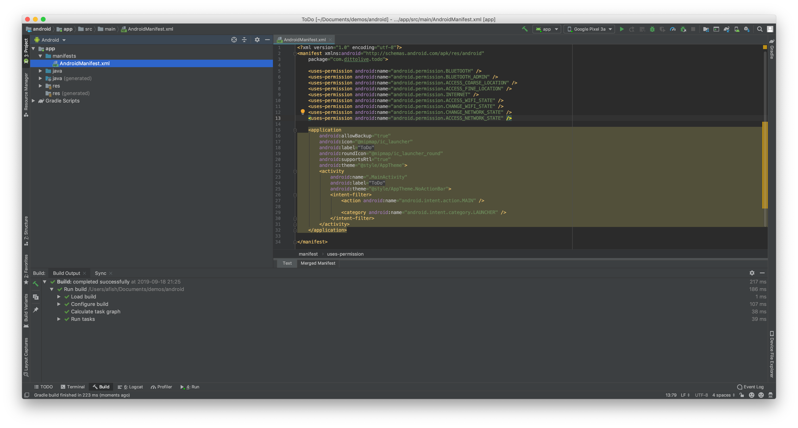
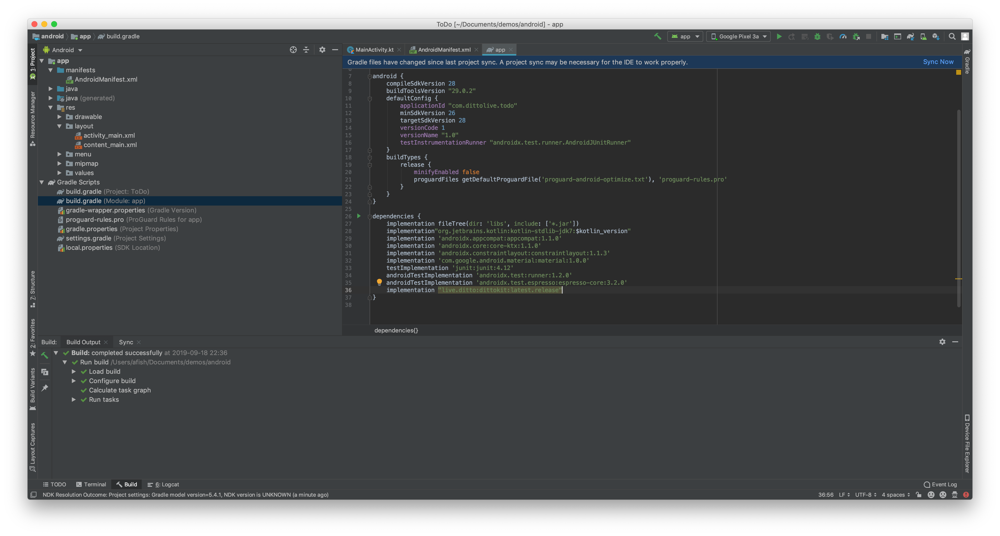

## 1-1 Create Android Studio Project

This guide is based on Android Studio 4.1 and Kotlin 1.4

The first step is to create a project. Go to `File → New → New Project` and select `Basic Activity`:

Next, fill out the options with the product name: "Tasks", choose Kotlin, and set the minimum API level to 26:


In newer version of Android Studio the Basic Activity template includes additional files that are not need for this tutorial. To continue, remove the following if they exist:
* FirstFragment.kt
* SecondFragment.kt
* fragment_first.xml
* fragment_second.xml
* nav_graph.xml

Android requires requesting permission to use Bluetooth Low Energy and P2P Wifi, open the `AndroidManifest.xml` and add the following:

```xml title=AndroidManifest.xml
    <uses-permission android:name="android.permission.BLUETOOTH"
        android:maxSdkVersion="30" />
    <uses-permission android:name="android.permission.BLUETOOTH_ADMIN"
        android:maxSdkVersion="30" />
    <uses-permission android:name="android.permission.BLUETOOTH_SCAN"
        android:usesPermissionFlags="neverForLocation" />
    <uses-permission android:name="android.permission.BLUETOOTH_ADVERTISE" />
    <uses-permission android:name="android.permission.BLUETOOTH_CONNECT" />
    <uses-permission android:name="android.permission.ACCESS_COARSE_LOCATION" />
    <uses-permission
        android:name="android.permission.ACCESS_FINE_LOCATION" />
    <uses-permission android:name="android.permission.INTERNET" />
    <uses-permission android:name="android.permission.ACCESS_WIFI_STATE" />
    <uses-permission android:name="android.permission.ACCESS_NETWORK_STATE" />
    <uses-permission android:name="android.permission.CHANGE_WIFI_MULTICAST_STATE" />
    <uses-permission android:name="android.permission.READ_EXTERNAL_STORAGE" />
    <uses-permission android:name="android.permission.WRITE_EXTERNAL_STORAGE" />
    <uses-permission android:name="android.permission.CHANGE_WIFI_STATE" />
    <uses-permission android:name="android.permission.CHANGE_NETWORK_STATE" />
```

It should look like this now:



## 1-2 Install Ditto

To install Ditto, we need to add it as a dependency in the `build.gradle`
script for the app, as well as ensuring that we have the relevant Java
compatibility set:

<div class="alert alert-warning">

For the UI in this example, we are still using Kotlin synthetics, which are no
longer bundled automatically. We need to add `kotlin-android-extensions` in the
the `plugins` section of `build.gradle` to enable.
</div>

```xml title=build.gradle
plugins {
    // ...
    id 'kotlin-android-extensions'
}

dependencies {
    // ...
    implementation "live.ditto:ditto:2.0.0-alpha1"
}

android {
    // ...

    compileOptions {
        sourceCompatibility JavaVersion.VERSION_1_8
        targetCompatibility JavaVersion.VERSION_1_8
    }
}
```



Be sure to `Sync Project with Gradle Files` after you add Ditto as a dependency. Click the elephant icon with the blue arrow in the top right to manually trigger if it doesn't prompt.

At this point, you have the basic project in place! Now we need to start to build the UI elements.
