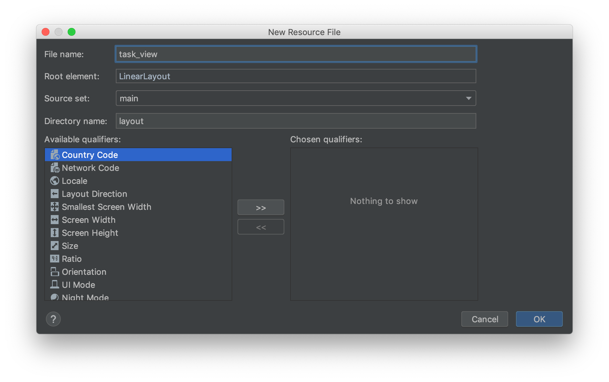

## 3-1 Configure Main Activity Part I

We need to import Ditto and create a few variables. Open the `MainActivity file` and replace the existing code with this:

```kotlin title=MainActivity
package live.ditto.tasks

import android.os.Bundle
import com.google.android.material.snackbar.Snackbar
import androidx.appcompat.app.AppCompatActivity
import android.view.Menu
import android.view.MenuItem
import androidx.recyclerview.widget.RecyclerView
import androidx.fragment.app.DialogFragment
import java.time.Instant

import kotlinx.android.synthetic.main.activity_main.*

import live.ditto.*
import live.ditto.android.DefaultAndroidDittoDependencies


class MainActivity : AppCompatActivity(), NewTaskDialogFragment.NewTaskDialogListener {
    private lateinit var recyclerView: RecyclerView
    private lateinit var viewAdapter: RecyclerView.Adapter<*>
    private lateinit var viewManager: RecyclerView.LayoutManager

    private var ditto: Ditto? = null
    private var collection: DittoCollection? = null
    private var liveQuery: DittoLiveQuery? = null

    override fun onCreate(savedInstanceState: Bundle?) {
        super.onCreate(savedInstanceState)
        setContentView(R.layout.activity_main)
        setSupportActionBar(toolbar)
    }
}

```

Run `Sync Project with Gradle Files` if it doesn't automatically.

## 3-2 Add New Task Functions

We will add a function and override two now that `MainActivity` is an abstract class. Insert this code after `onCreate()` function in the class:

```kotlin title=MainActivity
override fun onDialogSave(dialog: DialogFragment, task:String) {
    // Add the task to Ditto
    this.collection!!.upsert(mapOf("body" to task, "isCompleted" to false))
}

override fun onDialogCancel(dialog: DialogFragment) { }

fun showNewTaskUI() {
    val newFragment = NewTaskDialogFragment.newInstance(R.string.add_new_task_dialog_title)
    newFragment.show(supportFragmentManager,"newTask")
}

```

## 3-3 Create A Task View Layout

Right click on the layouts folder in the project and Go to `File → New → XML → Layout XML`. Name the file `task_view`:



Open the `task_view.xml` layout file and replace the XML in the text representation view. This will add a text view and checkbox to display the task in each row of the `RecyclerView`:

```xml title=task_view.xml
<?xml version="1.0" encoding="utf-8"?>
<androidx.constraintlayout.widget.ConstraintLayout xmlns:android="http://schemas.android.com/apk/res/android"
    xmlns:app="http://schemas.android.com/apk/res-auto"
    xmlns:tools="http://schemas.android.com/tools"
    android:id="@+id/linearLayout"
    android:layout_width="match_parent"
    android:layout_height="wrap_content">

    <TextView
        android:id="@+id/taskTextView"
        android:layout_width="0dp"
        android:layout_height="wrap_content"
        android:layout_marginStart="8dp"
        android:layout_marginTop="8dp"
        android:layout_marginEnd="8dp"
        android:layout_marginBottom="8dp"
        android:text="TextView"
        android:textAppearance="@style/TextAppearance.AppCompat.Large"
        app:layout_constraintBottom_toBottomOf="parent"
        app:layout_constraintEnd_toStartOf="@+id/taskCheckBox"
        app:layout_constraintStart_toStartOf="parent"
        app:layout_constraintTop_toTopOf="parent" />

    <CheckBox
        android:id="@+id/taskCheckBox"
        android:layout_width="wrap_content"
        android:layout_height="wrap_content"
        android:layout_marginTop="8dp"
        android:layout_marginEnd="8dp"
        android:layout_marginBottom="8dp"
        android:backgroundTint="#FFFFFF"
        android:clickable="false"
        app:layout_constraintBottom_toBottomOf="parent"
        app:layout_constraintEnd_toEndOf="parent"
        app:layout_constraintStart_toEndOf="@+id/taskTextView"
        app:layout_constraintTop_toTopOf="parent" />
</androidx.constraintlayout.widget.ConstraintLayout>

```

The layout should look like this now:


## 3-4 Configure Main Activity Part II

We now need to continue to configure the `MainActivity` to customize the `RecyclerView`, to display the tasks and add the logic for the user actions. Replace the `onCreate()` function with this code that will configure the recycler view:

```kotlin title=MainActivity
override fun onCreate(savedInstanceState: Bundle?) {
    super.onCreate(savedInstanceState)
    setContentView(R.layout.activity_main)
    setSupportActionBar(toolbar)

    // Setup the layout
    viewManager = LinearLayoutManager(this)
    val tasksAdapter = TasksAdapter()
    viewAdapter = tasksAdapter

    recyclerView = findViewById<RecyclerView>(R.id.recyclerView).apply {
        setHasFixedSize(true)
        layoutManager = viewManager
        adapter = viewAdapter
    }

    recyclerView.addItemDecoration(DividerItemDecoration(this, DividerItemDecoration.VERTICAL))

}

```

## 3-5 Add TasksAdapter

We need to declare a `RecyclerView.Adapter` to provide a data source to the `RecyclerView`. Add this code to the bottom of `MainActivity`, as a new class within the file:

```kotlin title=MainActivity
class TasksAdapter: RecyclerView.Adapter<TasksAdapter.TaskViewHolder>() {
    private val tasks = mutableListOf<DittoDocument>()

    var onItemClick: ((DittoDocument) -> Unit)? = null

    class TaskViewHolder(v: View): RecyclerView.ViewHolder(v)

    override fun onCreateViewHolder(parent: ViewGroup, viewType: Int): TaskViewHolder {
        val view = LayoutInflater.from(parent.context).inflate(R.layout.task_view, parent, false)
        return TaskViewHolder(view)
    }

    override fun onBindViewHolder(holder: TaskViewHolder, position: Int) {
        val task = tasks[position]
        holder.itemView.taskTextView.text = task["body"].stringValue
        holder.itemView.taskCheckBox.isChecked = task["isCompleted"].booleanValue
        holder.itemView.setOnClickListener {
            // NOTE: Cannot use position as this is not accurate based on async updates
            onItemClick?.invoke(tasks[holder.adapterPosition])
        }
    }

    override fun getItemCount() = this.tasks.size

    fun tasks(): List<DittoDocument> {
        return this.tasks.toList()
    }

    fun set(tasks: List<DittoDocument>): Int {
        this.tasks.clear()
        this.tasks.addAll(tasks)
        return this.tasks.size
    }

    fun inserts(indexes: List<Int>): Int {
        for (index in indexes) {
            this.notifyItemRangeInserted(index, 1)
        }
        return this.tasks.size
    }

    fun deletes(indexes: List<Int>): Int {
        for (index in indexes) {
            this.notifyItemRangeRemoved(index, 1)
        }
        return this.tasks.size
    }

    fun updates(indexes: List<Int>): Int {
        for (index in indexes) {
            this.notifyItemRangeChanged(index, 1)
        }
        return this.tasks.size
    }

    fun moves(moves: List<DittoLiveQueryMove>) {
        for (move in moves) {
            this.notifyItemMoved(move.from, move.to)
        }
    }

    fun setInitial(tasks: List<DittoDocument>): Int {
        this.tasks.addAll(tasks)
        this.notifyDataSetChanged()
        return this.tasks.size
    }
}

```

## 3-6 Add Swipe To Delete

To match the iOS getting started app, we also want to add swipe to delete functionality. Insert this code at the bottom of `MainActivity` as a new class:

```kotlin title=MainActivity
// Swipe to delete based on https://medium.com/@kitek/recyclerview-swipe-to-delete-easier-than-you-thought-cff67ff5e5f6
abstract class SwipeToDeleteCallback(context: Context) : ItemTouchHelper.SimpleCallback(0, ItemTouchHelper.LEFT) {

    private val deleteIcon = ContextCompat.getDrawable(context, android.R.drawable.ic_menu_delete)
    private val intrinsicWidth = deleteIcon!!.intrinsicWidth
    private val intrinsicHeight = deleteIcon!!.intrinsicHeight
    private val background = ColorDrawable()
    private val backgroundColor = Color.parseColor("#f44336")
    private val clearPaint = Paint().apply { xfermode = PorterDuffXfermode(PorterDuff.Mode.CLEAR) }


    override fun onMove(recyclerView: RecyclerView, viewHolder: RecyclerView.ViewHolder, target: RecyclerView.ViewHolder): Boolean {
        return false
    }

    override fun onChildDraw(
        c: Canvas, recyclerView: RecyclerView, viewHolder: RecyclerView.ViewHolder,
        dX: Float, dY: Float, actionState: Int, isCurrentlyActive: Boolean
    ) {

        val itemView = viewHolder.itemView
        val itemHeight = itemView.bottom - itemView.top
        val isCanceled = dX == 0f && !isCurrentlyActive

        if (isCanceled) {
            clearCanvas(c, itemView.right + dX, itemView.top.toFloat(), itemView.right.toFloat(), itemView.bottom.toFloat())
            super.onChildDraw(c, recyclerView, viewHolder, dX, dY, actionState, isCurrentlyActive)
            return
        }

        // Draw the red delete background
        background.color = backgroundColor
        background.setBounds(itemView.right + dX.toInt(), itemView.top, itemView.right, itemView.bottom)
        background.draw(c)

        // Calculate position of delete icon
        val deleteIconTop = itemView.top + (itemHeight - intrinsicHeight) / 2
        val deleteIconMargin = (itemHeight - intrinsicHeight) / 2
        val deleteIconLeft = itemView.right - deleteIconMargin - intrinsicWidth
        val deleteIconRight = itemView.right - deleteIconMargin
        val deleteIconBottom = deleteIconTop + intrinsicHeight

        // Draw the delete icon
        deleteIcon!!.setBounds(deleteIconLeft, deleteIconTop, deleteIconRight, deleteIconBottom)
        deleteIcon.setTint(Color.parseColor("#ffffff"))
        deleteIcon.draw(c)

        super.onChildDraw(c, recyclerView, viewHolder, dX, dY, actionState, isCurrentlyActive)
    }

    private fun clearCanvas(c: Canvas?, left: Float, top: Float, right: Float, bottom: Float) {
        c?.drawRect(left, top, right, bottom, clearPaint)
    }
}
```

Almost there! At this point, we have most of the app created, but we now need to integrate Ditto!
