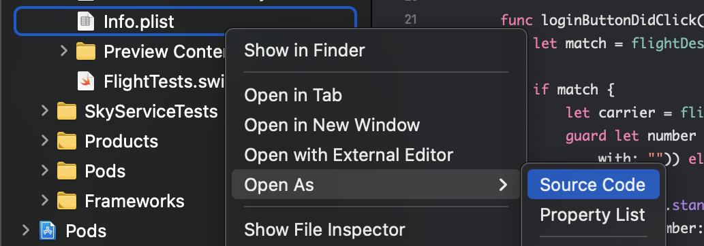

import Tabs from '@theme/Tabs';
import TabItem from '@theme/TabItem';

# iOS Installation Instructions

1. [Ensure you have CocoaPods 1.1.0 or later](https://guides.cocoapods.org/using/getting-started.html)
2. Ensure you have `use_frameworks!` in your Podfile
3. Add `DittoSwift` to your __Podfile__ like so:

```ruby
pod 'DittoSwift'
```

If you are installing for an Objective-C project use the following CocoaPod instead.

```ruby
pod 'DittoObjC'
```

4. Add the following permissions in your `Info.plist` so that your app can use all the necessary communication channels. Right click on your project's `Info.plist` file, click `Open As > Source Code`.



5. _Add_ the following keys. 

```xml title=Info.plist
<key>NSBluetoothAlwaysUsageDescription</key>
<string>Uses Bluetooth to connect and sync with nearby devices</string>
<key>NSBluetoothPeripheralUsageDescription</key>
<string>Uses Bluetooth to connect and sync with nearby devices</string>
<key>NSLocalNetworkUsageDescription</key>
<string>Uses WiFi to connect and sync with nearby devices</string>
<key>NSBonjourServices</key>
<array>
  <string>_http-alt._tcp.</string>
</array>
```

The values like `<string>Uses WiFi to connect and sync with nearby devices</string>` will be displayed in a prompt. Replace it with whatever language is best for your users.

6. You can now use Ditto in your application:

<Tabs
  groupId="programming-language"
  defaultValue="swift"
  values={[
    {label: 'Swift', value: 'swift'},
    {label: 'Objective-C', value: 'objc'},
  ]
}>
<TabItem value="swift">

```swift
import DittoSwift

let ditto = Ditto()
ditto.setLicenseToken("my license token")
try! ditto.tryStartSync()
```

</TabItem>
<TabItem value="objc">

```objc
#import <DittoObjC/DittoObjC.h>


DITDitto *ditto = [[DITDitto alloc] init];
[ditto setLicenseToken: @"my license token"];
NSError *error = nil;
[ditto tryStartSync:&error];
```

</TabItem>
</Tabs>