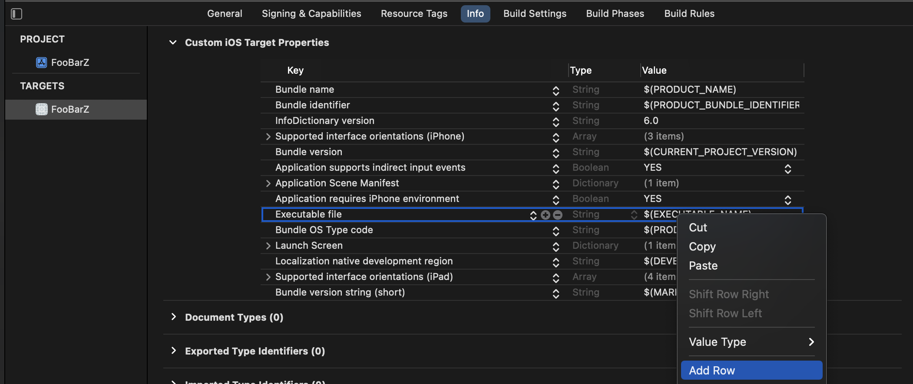

import Tabs from '@theme/Tabs';
import TabItem from '@theme/TabItem';

# iOS Installation Instructions

1. [Ensure you have CocoaPods 1.1.0 or later](https://guides.cocoapods.org/using/getting-started.html)
2. Ensure you have `use_frameworks!` in your Podfile
3. Add the following to your __Podfile__ like so:

<Tabs
  groupId="programming-language"
  defaultValue="swift"
  values={[
    {label: 'Swift', value: 'swift'},
    {label: 'Objective-C', value: 'objc'},
  ]
}>
<TabItem value="swift">

```ruby
pod 'DittoSwift'
```

</TabItem>
<TabItem value="objc">

```ruby
pod 'DittoObjC'
```

</TabItem>
</Tabs>

And run `pod install --repo-update` to install the latest versions.

4. Navigate to your App's __Target__ and go to the __Info__ tab and right click on any row and __Add Row__.



5. _Add_ the following keys to your Info.plist. 

<Tabs
groupId="info-plist"
  defaultValue="info-tab"
  values={[
    {label: "From Info Tab", value: 'info-tab'},
    {label: "From Source Code", value: 'source-code'},
  ]
}>

<TabItem value="info-tab">

Add the following values to your Info tab.

```
Key: NSBluetoothAlwaysUsageDescription
Type: String
Value: Uses Bluetooth to connect and sync with nearby devices

Key: NSBluetoothPeripheralUsageDescription
Type: String
Value: Uses Bluetooth to connect and sync with nearby devices

Key: NSLocalNetworkUsageDescription
Type: String
Value: Uses WiFi to connect and sync with nearby devices

Key: NSBluetoothPeripheralUsageDescription
Type: String
Value: Uses Bluetooth to connect and sync with nearby devices

Key: NSBonjourServices
Type: String
Value: _http-alt._tcp.
```

</TabItem>
<TabItem value="source-code">

If your app already has an __Info.plist__ file, you can right click on it and __Open As Source__ and add the following values.

```xml title=Info.plist
<key>NSBluetoothAlwaysUsageDescription</key>
<string>Uses Bluetooth to connect and sync with nearby devices</string>
<key>NSBluetoothPeripheralUsageDescription</key>
<string>Uses Bluetooth to connect and sync with nearby devices</string>
<key>NSLocalNetworkUsageDescription</key>
<string>Uses WiFi to connect and sync with nearby devices</string>
<key>NSBonjourServices</key>
<array>
  <string>_http-alt._tcp.</string>
</array>
```

</TabItem>

</Tabs>

The values like `Uses WiFi to connect and sync with nearby devices` will be displayed in a prompt. Replace it with whatever language is best for your users.

6. You can now use Ditto in your application:

<Tabs
  groupId="programming-language"
  defaultValue="swift"
  values={[
    {label: 'Swift', value: 'swift'},
    {label: 'Objective-C', value: 'objc'},
  ]
}>
<TabItem value="swift">

```swift
import DittoSwift

let ditto = Ditto()
try! ditto.setLicenseToken("my license token")
try! ditto.tryStartSync()
```

</TabItem>
<TabItem value="objc">

```objc
#import <DittoObjC/DittoObjC.h>


DITDitto *ditto = [[DITDitto alloc] init];
NSError *error = nil;

if (![ditto setLicenseToken:@"my license token": error:&error]) {
  NSLog(@"Error setting license token: %@", error);
}

if (![ditto tryStartSync:&error]) {
  NSLog(@"Error starting sync: %@", error);
}
```

</TabItem>
</Tabs>