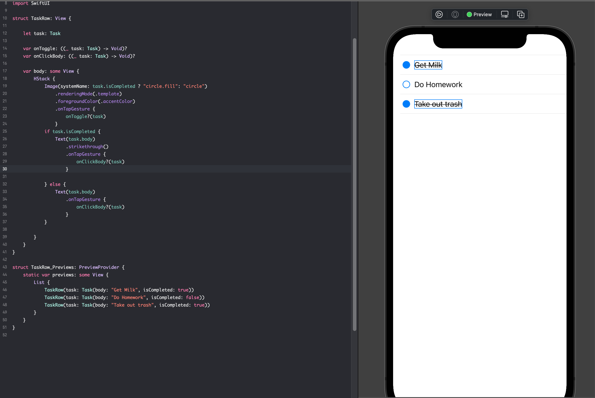
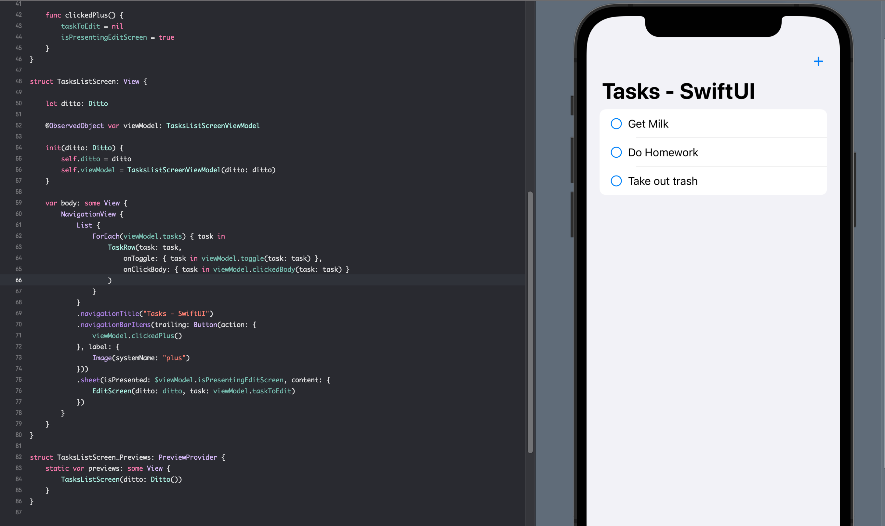

In the last part of the tutorial we referenced a class called `TasksListScreen`. This screen will show a `List<Task>` using a JetPack Compose Column.

## 3-1 Create a `TaskRow` views

Each row of the tasks will be represented by a SwiftUI `View` called `TaskRow` which takes in a `Task` and two callbacks which we will use later.

1. If the `task.isCompleted` is `true`, we will show a filled circle icon and a
strikethrough style for the `body`.
2. If the `task.isCompleted` is `false`, we will show an open circle icon.
3. If the user taps the `Icon`, we will call a `onToggle: ((_ task: Task) -> Void)?`, we will reverse the `isCompleted` from `true` to `false` or `false` to `true`
4. If the user taps the `Text`, we will call a `onClickBody: ((_ task: Task) -> Void)?`. We will use this to navigate an `EditScreen` (we will create this later)

For brevity, we will skip discussions on styling as it's best to see the code snippet below:

We've also included a `TaskRow_Previews` that allows you to see the end result with some test data quickly.



```swift title="TaskRow.swift"
import SwiftUI

struct TaskRow: View {

    let task: Task

    var onToggle: ((_ task: Task) -> Void)?
    var onClickBody: ((_ task: Task) -> Void)?

    var body: some View {
        HStack {
            // 2.
            Image(systemName: task.isCompleted ? "circle.fill": "circle")
                .renderingMode(.template)
                .foregroundColor(.accentColor)
                .onTapGesture {
                    onToggle?(task)
                }
            if task.isCompleted {
                Text(task.body)
                    // 2.
                    .strikethrough()
                    .onTapGesture {
                        onClickBody?(task)
                    }

            } else {
                // 3.
                Text(task.body)
                    .onTapGesture {
                        onClickBody?(task)
                    }
            }

        }
    }
}

struct TaskRow_Previews: PreviewProvider {
    static var previews: some View {
        List {
            TaskRow(task: Task(body: "Get Milk", isCompleted: true))
            TaskRow(task: Task(body: "Do Homework", isCompleted: false))
            TaskRow(task: Task(body: "Take out trash", isCompleted: true))
        }
    }
}
```

## 3-2 Create a `TasksListScreenViewModel`

In the world of SwiftUI, the most important design pattern is the MVVM, which stands for Model-View-ViewModel. MVVM strives to separate all data manipulation (Model and ViewModel) and data presentation (UI or View) into distinct areas of concern. When it comes to Ditto, we recommend that you never include references to edit `ditto` in `View.body`. All interactions with `ditto` for `upsert`, `update`, `find`, `remove` and `observe` should be within a `ViewModel`. The View should only render data from observable variables from the `ViewModel` and only the `ViewModel` should make direct edits to these variables.

Typically we create a `ViewModel` per screen or per page of an application. For the `TasksListScreen` we need some functionality like:

* Showing a realtime list of `Task` objects
* Triggering an intention to edit a `Task`
* Triggering an intention to create a `Task`
* Clicking an icon to toggle the icon from `true` to `false` or `false` to `true`

In SwiftUI we create a view model by inheriting the `ObservableObject`. The `ObservableObject` allows SwiftUI to watch changes to certain variables to trigger view updates intelligently. To learn more about `ObservableObject` we recommend this excellent [tutorial from Hacking with Swift](https://www.hackingwithswift.com/quick-start/swiftui/how-to-use-observedobject-to-manage-state-from-external-objects).

1. Create a file called __TasksListScreenViewModel.swift__ in your project
2. Add an `init` constructor to pass in a `ditto: Ditto` instance and store it in a local variable.
3. Create two `@Published` variables for `tasks` and i`sPresentingEditScreen`. `@Published` variables are special variables of an `ObservableObject`. If these variables change, SwiftUI will update the view accordingly. Any variables that are _not_ decorated with `@Published` can change but will be ignored by SwiftUI.
4. We also add a normal variable, `private(set) var taskToEdit: Task? = nil`. When a user is attempting to _edit_ a task, we need to tell the view model which task the user would like to edit. This does not need to trigger a view reload, so it's a simple variable.
5. Here's where the magic happens. As soon as the `TasksListScreenViewModel` is initialized, we need to `.observe` all the tasks by creating a live query. To prevent the `liveQuery` from being prematurely deallocated, we store it as a variable. In the observe callback, we convert all the documents into `Task` objects and set it to the `@Published tasks` variable. Every time to `.observe` fires, SwiftUI will pick up the changes and tell the view to render the list of tasks.
6. We will add an eviction call to the initializer that will remove any deleted documents from the collection
7. Add a function called `toggle()`. When a user clicks on a task's image icon, we need to trigger reversing the `isCompleted` state. In the function body we add a standard call to find the task by it's `_id` and attempt to mutate the `isCompleted` property.
8. Add a function called `clickedBody`. When the user taps the `TaskRow`'s `Text` field, we need to store that task and change the `isPresentingEditScreen` to true. This will give us enough information to present a `.sheet` in the `TasksListScreenViewModel` to feed to the `EditScreen`
9. In the previous setup of the `TasksListScreen`, we added a `navigationBarItem` with a plus icon. When the user clicks this button we need to tell the view model that it should show the `EditScreen`. So we've set the `isPresentingEditScreen` property to `true`. However, because we are attempting to _create_ a `Task`, we need to set the `taskToEdit` to `nil` because we don't yet have a task.


```swift title="TasksListScreenViewModel.swift"
class TasksListScreenViewModel: ObservableObject {

    // 3.
    // highlight-start
    @Published var tasks = [Task]()
    @Published var isPresentingEditScreen: Bool = false
    // highlight-end

    // 4.
    // highlight-next-line
    private(set) var taskToEdit: Task? = nil

    let ditto: Ditto
    // 5.
    // highlight-start
    var liveQuery: DittoLiveQuery?

    init(ditto: Ditto) {
        self.ditto = ditto
        self.liveQuery = ditto.store["tasks"]
            .find("!isDeleted")
            .observe(eventHandler: {  docs, _ in
                self.tasks = docs.map({ Task(document: $0) })
            })
        
        //6.
        ditto.store["tasks"].find("isDeleted == true").evict()
    }
    // highlight-end

    // 7.
    // highlight-start
    func toggle(task: Task) {
        self.ditto.store["tasks"].findByID(task._id)
            .update { mutableDoc in
                guard let mutableDoc = mutableDoc else { return }
                mutableDoc["isCompleted"].set(!mutableDoc["isCompleted"].boolValue)
            }
    }
    // highlight-end

    // 8.
    // highlight-start
    func clickedBody(task: Task) {
        taskToEdit = task
        isPresentingEditScreen = true
    }
    // highlight-end

    // 9.
    // highlight-start
    func clickedPlus() {
        taskToEdit = nil
        isPresentingEditScreen = true
    }
    // highlight-end
}
```


## 3-3 Render `TaskRow` in a `ForEach` within the `TasksListScreen`

Now we need to update our `TasksListScreen` to properly bind any callbacks, events, and data to the `TasksListScreenViewModel`.

1. Back in the `TasksListScreen` view, we need to construct our `TasksListScreenViewModel` and store it as an `@ObservedObject`. This `@ObservedObject` tells the view to watch for specific changes in the `viewModel` variable.
2. We will need to store our `ditto` object to pass to the `EditScreen` later.
3. In our `body` variable, find the `List` and add:

```swift
ForEach(viewModel.tasks) { task in
    TaskRow(task: task,
        onToggle: { task in viewModel.toggle(task: task) },
        onClickBody: { task in viewModel.clickedBody(task: task) }
    )
}
```

This will tell the list to iterate over all the `viewModel.tasks` and render a `TaskRow`. In each of the `TaskRow` children, we need to bind the `onToggle` and `onClick` callbacks to the viewModel methods.

4. Bind the plus button to the `viewModel.clickedPlus` event
5. Now we need to present a `.sheet` which will activate based on the `$viewModel.isPresentingEditScreen` variable. Notice how we added the `$` before `viewModel`. `.sheet` can edit the `isPresentingEditScreen` once it's dismissed, so we need to treat the variable as a bidirectional binding.
6. We've also included a `TasksListScreen_Previews` so that you can add some test data and see the result in a live view.



```swift title="TasksListScreen.swift"
struct TasksListScreen: View {

    // 2.
    // highlight-next-line
    let ditto: Ditto

    // 1.
    // highlight-start
    @ObservedObject var viewModel: TasksListScreenViewModel

    init(ditto: Ditto) {
        self.ditto = ditto
        self.viewModel = TasksListScreenViewModel(ditto: ditto)
    }
    // highlight-end

    var body: some View {
        NavigationView {
            List {
                // 3.
                // highlight-start
                ForEach(viewModel.tasks) { task in
                    TaskRow(task: task,
                        onToggle: { task in viewModel.toggle(task: task) },
                        onClickBody: { task in viewModel.clickedBody(task: task) }
                    )
                }
                // highlight-end
            }
            .navigationTitle("Tasks - SwiftUI")
            .navigationBarItems(trailing: Button(action: {
                // 4
                // highlight-next-line
                viewModel.clickedPlus()
            }, label: {
                Image(systemName: "plus")
            }))
            // 5.
            // highlight-start
            .sheet(isPresented: $viewModel.isPresentingEditScreen, content: {
                EditScreen(ditto: ditto, task: viewModel.taskToEdit)
            })
            // highlight-end
        }
    }
}
// 6.
// highlight-start
struct TasksListScreen_Previews: PreviewProvider {
    static var previews: some View {
        TasksListScreen(ditto: Ditto())
    }
}
// highlight-end
```

:::tip
Notice that we _DO NOT HAVE TO_ manipulate the `tasks` value. Calling `.update` on `ditto` will automatically fire the liveQuery to update the `tasks`. You can always trust the liveQuery to immediately update the `@Published var tasks`. There is no reason to poll or force reload. Ditto will automatically handle the state changes and SwiftUI will pick these changes up automatically.
:::
