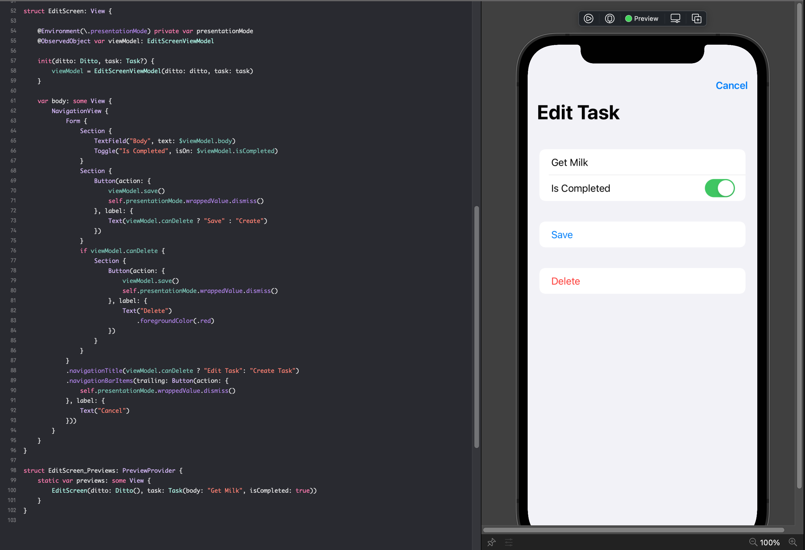

Our final screen will be the `EditScreen` and it's ViewModel. The `EditScreen` will be in charge of 3 functions:

* Editing an existing `Task`
* Creating a `Task` and inserting into the tasks collection
* Deleting an existing `Task`

## 4-1 Creating the `EditScreenViewModel`

Like before, we need to create an `EditScreenViewModel` for the `EditScreen`. Since we've already gone over the concepts of MVVM, we will go a bit faster.

1. The `EditScreenViewModel` needs to be initialized with `ditto` and an optional `task: Task?` value. If the task value is `nil` we need to set the `canDelete` variable to `false`. This means that the user is attempting _create_ a new `Task`. We will use this value to show a delete `Button` in the `EditScreen` later. We will store the `_id: String?` from the `task` parameter and use it later in the `save()` function.
2. We need two `@Published` variables to bind to a `TextField` and `Toggle` SwiftUI views for the task's `isCompleted` and `body` values. If the `task == nil`, we will set some default values like an empty string and a false `isCompleted` value.
3. When the user wants to click a save `Button`, we need to `save()` and handle either an `.upsert` or `.update` function appropriately. If the local `_id` variable is `nil`, we assume the user is attempting to create a `Task` and will call ditto's `.upsert` function. Otherwise, we will attempt to `.update` an existing task with a known `_id`.
4. Finally if a delete button is clicked, we attempt to find the document and call `.remove`

```swift title="EditScreenViewModel.swift"
import SwiftUI
import DittoSwift

class EditScreenViewModel: ObservableObject {

    @Published var canDelete: Bool = false
    // 2.
    // highlight-start
    @Published var body: String = ""
    @Published var isCompleted: Bool = false
    // highlight-end

    // 1.
    // highlight-start
    private let _id: String?
    private let ditto: Ditto

    init(ditto: Ditto, task: Task?) {
        self._id = task?._id
        self.ditto = ditto

        canDelete = task != nil
        body = task?.body ?? ""
        isCompleted = task?.isCompleted ?? false
    }
    // highlight-end

    // 3.
    // highlight-start
    func save() {
        if let _id = _id {
            // the user is attempting to update
            ditto.store["tasks"].findByID(_id).update({ mutableDoc in
                mutableDoc?["isCompleted"].set(self.isCompleted)
                mutableDoc?["body"].set(self.body)
            })
        } else {
            // the user is attempting to upsert
            try! ditto.store["tasks"].upsert([
                "body": body,
                "isCompleted": isCompleted,
                "isDeleted": false
            ])
        }
    }
    // highlight-end

    // 4.
    // highlight-start
    func delete() {
        guard let _id = _id else { return }
        ditto.store["tasks"].findByID(_id).update { doc in
            doc?["isDeleted"].set(true)
        }
    }
    // highlight-end
}
```


## 4-3 Create the `EditScreen`:

Like the `TasksListScreen.swift` in the previous section, we will create an `EditScreen.swift`.
This screen will use SwiftUI's Form and Section wrapper.

1. An `TextField` which we use to edit the `Task.body`
2. A `Switch` which is used to edit the `Task.isCompleted`
3. A `Button` for saving a task.
4. A `Button` for deleting a task




1. In the `EditScreen` we need to add a `@Environment(\.presentationMode) private var presentationMode`. In SwiftUI views house some environment variables. Because the `TasksListScreen` presened the `EditScreen` as a `.sheet`, we need a way to dismiss the current screen if the user taps any of the buttons. To learn more about `Environment`, [read Apple's official documentation.](https://developer.apple.com/documentation/swiftui/environment). To dismiss the current screen we can call `self.presentationMode.wrappedValue.dismiss()`
2. Like before, store the `EditScreenViewModel` as an `ObservedObject`. Pass the `task: Task?` and the `ditto` instance to properly initialize the `EditScreenViewModel`. Now the ViewModel should know if the user is attempting a creation or update flow.
3. We now can bind the `TextField` for the `$viewModel.body` and `Toggle` to the `$viewModel.isCompleted`. Notice the `$`, this allows SwiftUI fields to bi-directionally edit these `@Published` values and trigger efficient view reloading.
4. Bind the save button's `action:` handler to the `viewModel.save()` function and dismiss the view. Whenever the user clicks the save button, they will save the current data and return back to the `TasksListScreen`
5. If the `viewModel.canDelete` is `true`, we can show a delete `Button`. Notice how we don't need the `$` since we are only reading the value once. Moreover, we do not need to tell SwiftUI to re-render on `canDelete` since it will never change during the `EditScreen`'s life cycle.
6. Bind the delete button's `action:` to the `viewModel.delete()` function and dismiss the view.
7. Finally we add a `EditScreen_Previews` so that you can easily watch the view's final rendering as you develop.

```swift title="EditScreen.swift"
struct EditScreen: View {

    // 1.
    // highlight-next-line
    @Environment(\.presentationMode) private var presentationMode

    // 2.
    // highlight-start
    @ObservedObject var viewModel: EditScreenViewModel

    init(ditto: Ditto, task: Task?) {
        viewModel = EditScreenViewModel(ditto: ditto, task: task)
    }
    // highlight-end

    var body: some View {
        NavigationView {
            Form {
                Section {
                    // 3.
                    // highlight-start
                    TextField("Body", text: $viewModel.body)
                    Toggle("Is Completed", isOn: $viewModel.isCompleted)
                    // highlight-end
                }
                Section {
                    Button(action: {
                        // 4.
                        // highlight-start
                        viewModel.save()
                        self.presentationMode.wrappedValue.dismiss()
                        // highlight-end
                    }, label: {
                        Text(viewModel.canDelete ? "Save" : "Create")
                    })
                }
                // 5.
                // highlight-next-line
                if viewModel.canDelete {
                    Section {
                        Button(action: {
                            // 6.
                            // highlight-start
                            viewModel.delete()
                            self.presentationMode.wrappedValue.dismiss()
                            // highlight-end
                        }, label: {
                            Text("Delete")
                                .foregroundColor(.red)
                        })
                    }
                }
            }
            .navigationTitle(viewModel.canDelete ? "Edit Task": "Create Task")
            .navigationBarItems(trailing: Button(action: {
                self.presentationMode.wrappedValue.dismiss()
            }, label: {
                Text("Cancel")
            }))
        }
    }
}

// 7.
// highlight-start
struct EditScreen_Previews: PreviewProvider {
    static var previews: some View {
        EditScreen(ditto: Ditto(), task: Task(body: "Get Milk", isCompleted: true))
    }
}
// highlight-end
```

## 4-4 Run the app!

Congratulations you are now complete with the Ditto SwiftUI task app!
