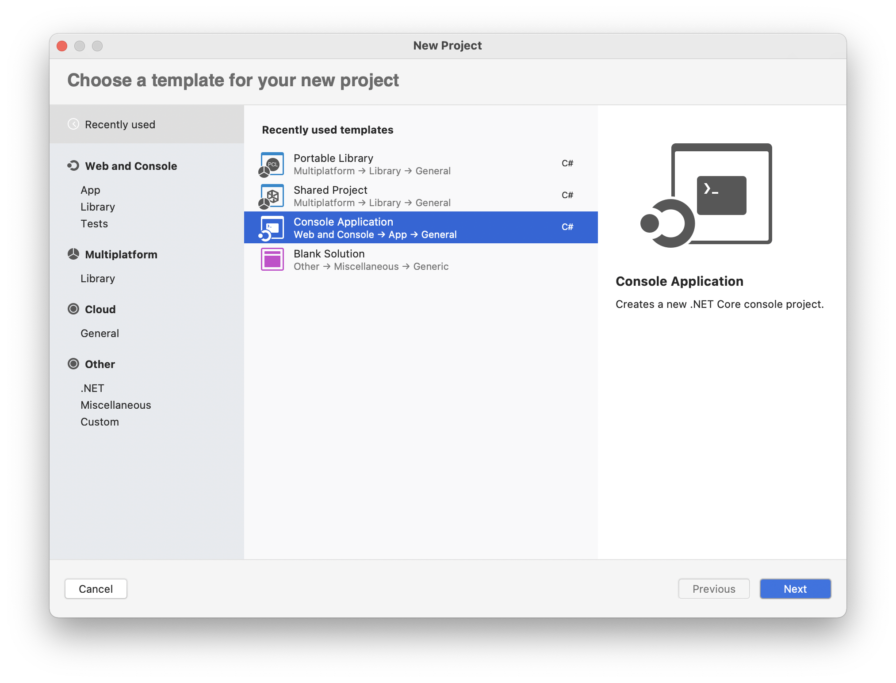

import Tabs from '@theme/Tabs';
import TabItem from '@theme/TabItem';

The following guide will show you how to build a Task list application with a standard C# Console App Starter Project. This tutorial assumes that you have some familiarity with starting up a new Visual Studio Project.

> Note: the C# SDK currently does not have the ability to sync over AWDL, LAN, or BLE communication just yet. We are working on this functionality. If this is very important to you please [contact us](mailto:contact@ditto.live).

## 1-1 Create a new Console Project

1. Open up Visual Studio for Windows or for Mac.
2. Create a __New Project__ and select __Console Application__



3. When the prompt asks to select a target framework, you can feel free to select either __.NET 5.0 or .NET Core 3.1__.

4. Choose a Project Name, for this example we went with __Tasks__.

## 1 - 2 Add Ditto to the project

We've deployed Ditto for C# on the standard NuGet package repository. We will need to add Ditto to this project.

1. Right click the project's __Dependencies__ folder, and click __Manage NuGet Dependencies_.
2. Search for __"Ditto"__ in the search bar and add the package called __"Ditto" by "Ditto"__. Ensure not to mistake it for another package.


If you prefer a different way of installation, feel free to take a look at the alternative ways to install or [reference the NuGet page here.](https://www.nuget.org/packages/Ditto/).

<Tabs
  groupId="dotnet-installation"
  defaultValue="javascript"
  values={[
    {label: "Package Manager", value: 'package-manager'},
    {label: '.NET CLI', value: 'cli'},
    {label: 'Package Reference', value: 'package-reference'},
  ]
}>
<TabItem value="package-manager">

```
Install-Package Ditto
```

</TabItem>
<TabItem value="cli">

```
dotnet add package Ditto
```

</TabItem>
<TabItem value="package-reference">

```xml
<PackageReference Include="Ditto" Version="1.*" />
```

</TabItem>
</Tabs>

3. In your __Program.cs__ file add `using DittoSDK` and `using System.Collections.Generic` to the top of the file like so:

```csharp title="Program.cs"
using System;
using DittoSDK;
using System.Collections.Generic;
```

4. Now we'll need to hold a reference to our Ditto instance as a `static` variable and also add a `static DittoLiveQuery` variable. These variables must be `static` because the console program's `Main` function is also `static`.
5. Instantiate the `ditto` static variable by constructing it with a development identity with an `appID: "live.ditto.tasks"`. If you want to sync with other tutorial app types like iOS or Android, you'll need to match the `appID` to enable sync. Also ensure to add your license token to `ditto.SetLicenseToken` to properly


```csharp title="Program.cs"
namespace Tasks
{
    class Program
    {
        // 4.
        // highlight-start
        static Ditto ditto;
        static DittoLiveQuery liveQuery;
        // highlight-end

        public static void Main(params string[] args)
        {
          // 5.
          // highlight-start
          ditto = new Ditto(identity: DittoIdentity.Development(appID: "live.ditto.tasks"));

          try
          {
              ditto.SetLicenseToken("<REPlACE_ME>");
              ditto.StartSync();
          }
          catch (DittoException ex)
          {
              Console.WriteLine("There was an error starting Ditto.");
              Console.WriteLine("Here's the following error");
              Console.WriteLine(ex.ToString());
              Console.WriteLine("Ditto cannot start sync but don't worry.");
              Console.WriteLine("Ditto will still work as a local database.");
          }
          Console.WriteLine("Welcome to Ditto's Task App");
          // highlight-end
        }
    }
}
```

## 1-3 Create a new file called __Task.cs__.

Ditto documents have a flexible structure. Oftentimes, in strongly-typed languages like C#, we will create a data structure give more definition to the app. Create a new C# file called __Task.cs__ in your project.


1. In the new file, you'll need to reference `System`, `System.Collections.Generic` and `DittoSDK`

2. Add the matching variables `string _id`, `string body`, and `bool isCompleted` to the struct. We will use this to match the document values to to the struct.

3. Add an constructor to Task that takes in a DittoDocument. In the constructor, parse out the document's keys with Ditto's type safe value accessors. This will safely map all the document's values to the struct's variables that we created in step 2. In addition we will add a couple of other constructor overloads for easier creation of data.

4. Override the `ToString()` method of the struct. We will later use this to easily print out a more readable string that we can use in `Console.WriteLine` back in the main __Program.cs__.

5. Add a function to the struct called `ToDictionary` which will serialize the values into a `Dictionary<string, object>`. This will assist us later when we need to insert a new document into Ditto.

```csharp title="Task.cs"
// 1.
// highlight-start
using System;
using System.Collections.Generic;
using DittoSDK;
// highlight-end

namespace Tasks
{
    public struct Task
    {
        string _id;
        string body;
        bool isCompleted;

        // 3
        // highlight-start
        public Task(string _id, string body, bool isCompleted)
        {
            this._id = _id;
            this.body = body;
            this.isCompleted = isCompleted;
        }

        public Task(string body, bool isCompleted)
        {
            this._id = Guid.NewGuid().ToString();
            this.body = body;
            this.isCompleted = isCompleted;
        }

        public Task(DittoDocument document)
        {
            this._id = document["_id"].StringValue;
            this.body = document["body"].StringValue;
            this.isCompleted = document["isCompleted"].BooleanValue;
        }
        // highlight-end

        // 4.
        // highlight-start
        public override string ToString()
        {
            return $"Task _id: {_id}, body: {body}, isCompleted: {isCompleted}";
        }
        // highlight-end

        // 5.
        // highlight-start
        public Dictionary<string, object> ToDictionary()
        {
            return new Dictionary<string, object>
            {
                { "_id", _id },
                { "body", body },
                { "isCompleted", isCompleted },
            };
        }
        // 5.
        // highlight-end
    }
}
```
