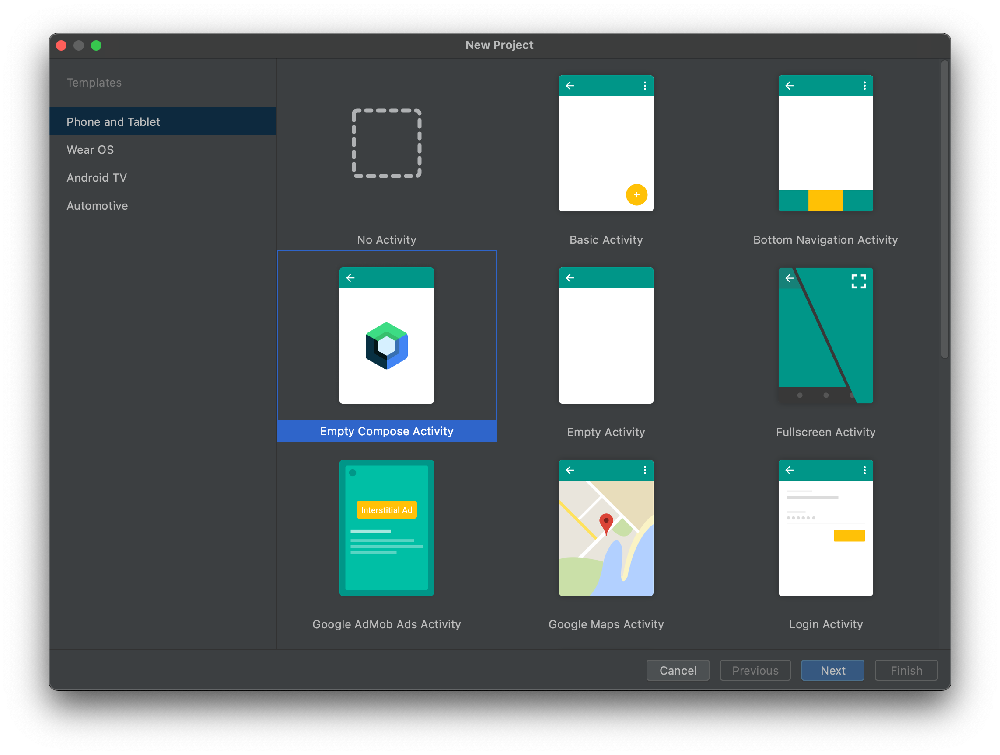
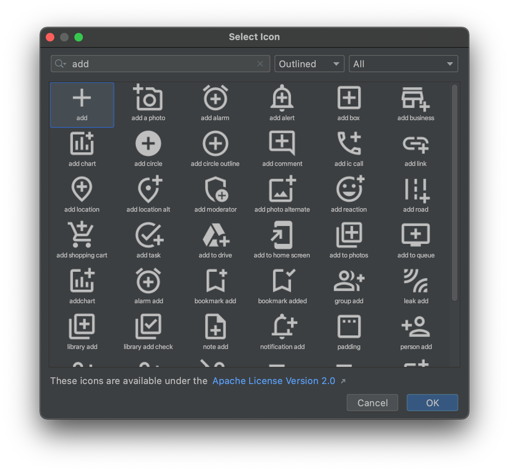
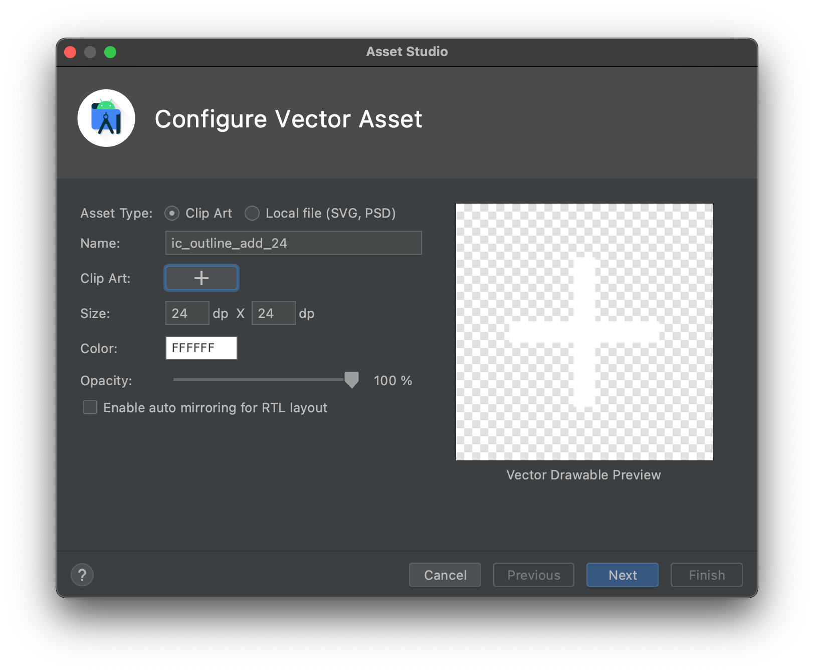

The following guide will show you how to build a Task list application with [Android Jetpack Compose](https://developer.android.com/jetpack/getting-started). The Jetpack Compose is a modern set of libraries to build Android apps with a declarative UI with Kotlin code and without writing any XML. 

Before getting started, you will need the latest version of [Android Studio Arctic Fox](https://developer.android.com/studio). In addition, for this tutorial, you should have a decent familiarity with Kotlin.

## 1-1 Create the App

Once you've had [Android Studio Arctic Fox](https://developer.android.com/studio) installed, Click __File > New Project__ and 



Fill out the information on the form similar to the screenshot below. These are recommended values however they are not crucial to complete this tutorial:

* Name: `"Tasks"`
* Package Name: `"live.ditto.tasks"`
* Save location: choose a directory
* Minimum SDK: `"API 25: Android 7.1.1 (Nougat)"`

And finally click "Finish" and wait for Android Studio to setup the project. 


## 1-2 Add dependencies

In your application's Module __build.gradle__ file add the additional dependencies.

```groovy title=build.gradle
dependencies {
  // ... existing dependencies
  
  // Add the following dependencies below
  
  // Ditto
  implementation "live.ditto:ditto:latest.release"
  // RxJava3
  implementation 'androidx.compose.runtime:runtime-rxjava3:1.0.1'
  // Jetpack Compose View Model
  implementation 'androidx.lifecycle:lifecycle-viewmodel-compose:1.0.0-alpha07'
  // Live Data
  implementation "androidx.compose.runtime:runtime-livedata:$compose_version"
  // JetPack Compose Navigation
  implementation "androidx.navigation:navigation-compose:2.4.0-alpha07"  
}

```

## 1-3 Add Vector Icons

We will need a couple of additional icons to show the tasks' completed, incompleted states. We will reference these vector resources in our code later. You will need to add 3 icons

1. Right click on the __res > drawable__ package and add a new __Vector Asset__ 



2. Select the "add" icon and select it for size `24`



3. Follow steps 1 and 2 for "circle"


4. Follow steps 1 and 2 for "circle" but for "outline"


You should have have 3 additional drawables with the following names:

* `ic_baseline_add_24.xml`
* `ic_baseline_circle_24.xml`
* `ic_outline_circle_24.xml`