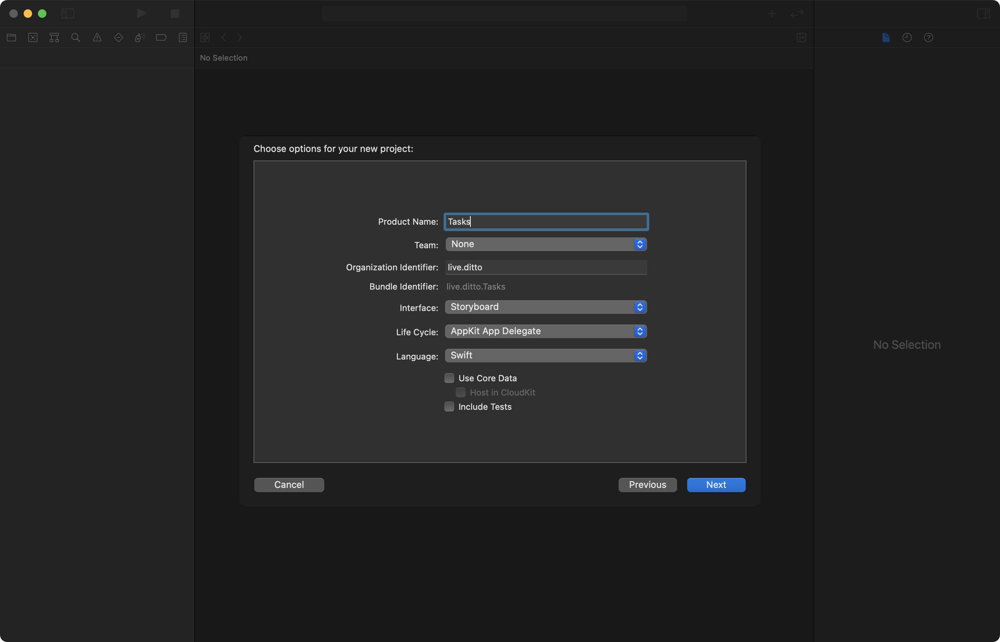
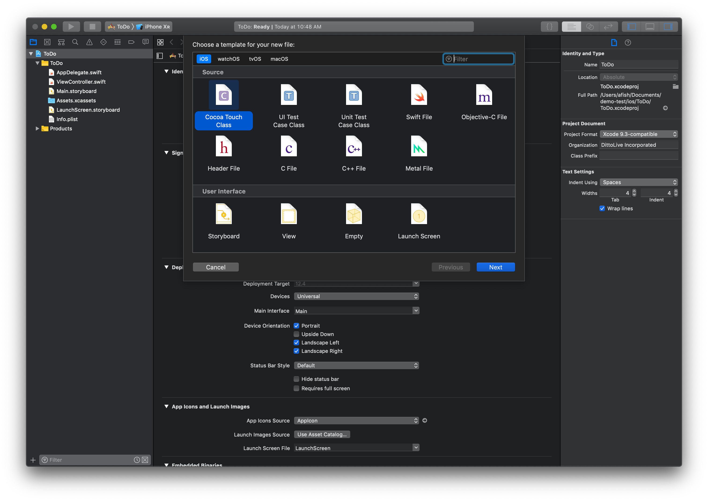
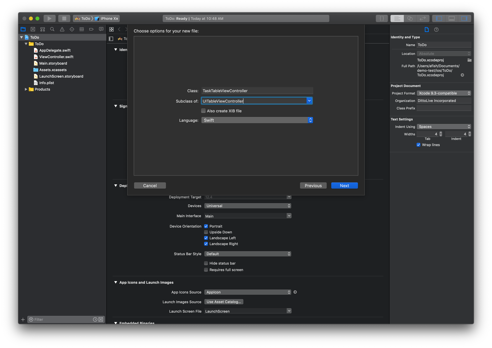
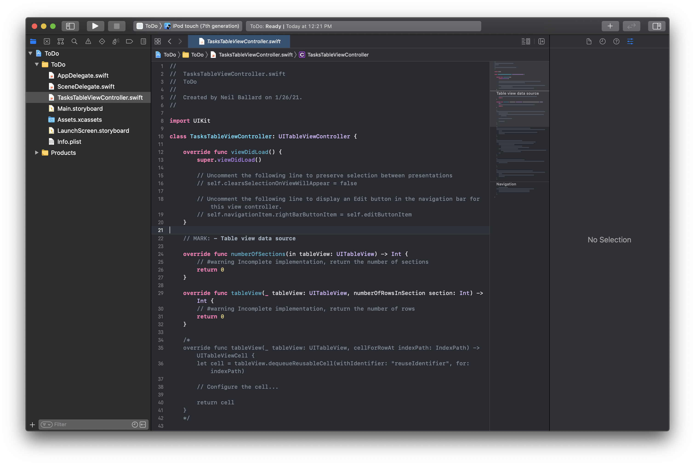

The first step is to create a basic Xcode project. Go to File New → Project and select "App":

Next, fill out the options with the product name: "Tasks" and choose the following values.

* For "Interface" -> "Storyboard"
* For "Life Cycle" -> "UIKit App Delegate"
* For Language -> "Swift"

## Create the UI Interface

The UI for the app will look like this:

This requires that we create several elements:

1. `UINavigationController` to represent the top navigation bar
2. `UITableViewController` which contains the UITableView to display the list of tasks
3. `UIBarButtonItem` which is in the navigation bar to display the UIAlertController to input the task name
For simplicity we will use the built-in storyboard to create these.

First, we need to add a new file to the project for the `UITableViewController`. Go to File New → File and select "Cocoa Touch Class":

Name your class `TasksTableViewController` and make sure it is a subclass of `UITableViewController`:

You can then delete the `ViewController.swift` file from the project so your structure should now look like this:

Now the project is set up, so we can configure `Main.storyboard` to create the UI.

### Configure Storyboard

Click on `Main.storyboard` to load the storyboard editor. The initial storyboard includes a scene tied to the ViewController. We deleted it, so we need to remove it and add a `UINavigationController` . Click on the View Controller Scene on the left-hand panel and click delete so the storyboard is now empty: